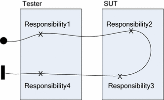

{docsify-updated}
# Pocketful of Rainbows:

### 1 - [opentelemetry-browser](https://github.com/devrimdemiroz/opentelemetry-browser)
👉 https://github.com/devrimdemiroz/opentelemetry-browser

### 2 - [opentelemetry-collector visualization](ideas/otelcol-mermaid-visualizer.md)

As discussed in latest Grafana Agent community call https://www.youtube.com/watch?v=ftopI1chyG0&t=1080s "Focus on data flow..." section, I tried how i would like to extract a visual from otel-config.yaml.

👉 [A couple of tries with mermaid](ideas/otelcol-mermaid-visualizer.md)

### 3 - Flamegraph like tracing graphs
Still missing good old flame graphs , wonder if it is somehow achievable someday...

### 4 - Aggregation on collector

https://github.com/grafana/tempo/pull/1378#discussion_r860658223

Such TraceQL in my point of view as well needs to be available on the collection point with the aggregation feature. 
I would prefer to use TraceQL as a processor on the collector, especially for aggregation. 
This is a known tactic to overcome some usual cons. Filter more, have less cardinality, less noise... 
so to solve some of them with aggregation as a layer before it reaches to a storage layer.

### 5 - Trace Based Testing
Slowly they appear.

| Date         | Link |
|--------------|------|
| Sep 24, 2021 | [Automated Test Metrics via Selenium + Opentelemetry](https://devrimdemiroz.gitlab.io/post/2021-09-24-seleniumopentelemetry/) |
| Sep 29, 2021 | [Cloud Native Live: Trace-Based Testing with OpenTelemetry](https://www.youtube.com/watch?v=4DvPbyOHb30)|
| Apr 26, 2022 | [Tracetest - Trace-based Testing with OpenTelemetry](https://kubeshop.io/blog/introducing-tracetest-trace-based-testing-with-opentelemetry)|

Trace based testing combination with Use Case Maps (UCM) urn modeling is worth looking into. With RUM and EUM aspects promises new doors towards testing.

