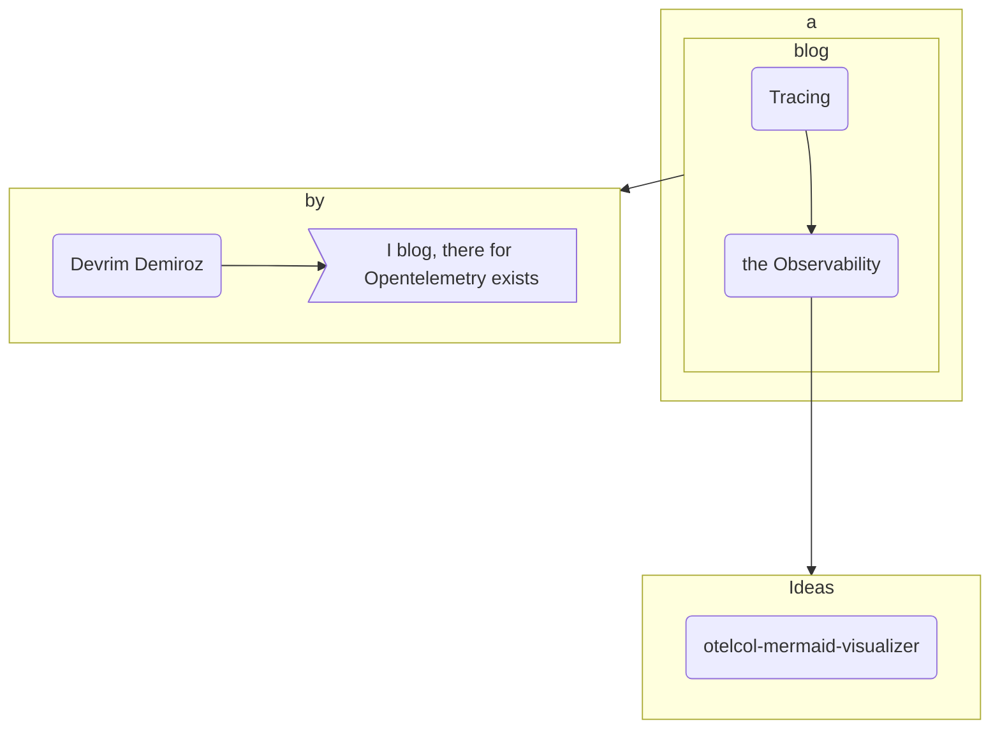

```mermaid
flowchart TD
          
    subgraph a
        direction LR
        
        subgraph blog
         direction LR
            Tracing(Tracing)
            Tracing --> the-observability(the Observability)
        end
        
     
    end
    

      
   
   
     subgraph by
       direction LR
            DD(Devrim Demiroz)
            DD-->Descartes>I blog, there for Opentelemetry exists]
     end

    blog --> by        
    
         
         subgraph Ideas
        direction LR
        
        otelcol-mermaid-visualizer(otelcol-mermaid-visualizer)
         
    end
    the-observability---->Ideas
      click otelcol-mermaid-visualizer "/Ideas/otelcol-mermaid-visualizer";     
    
        

  
```
