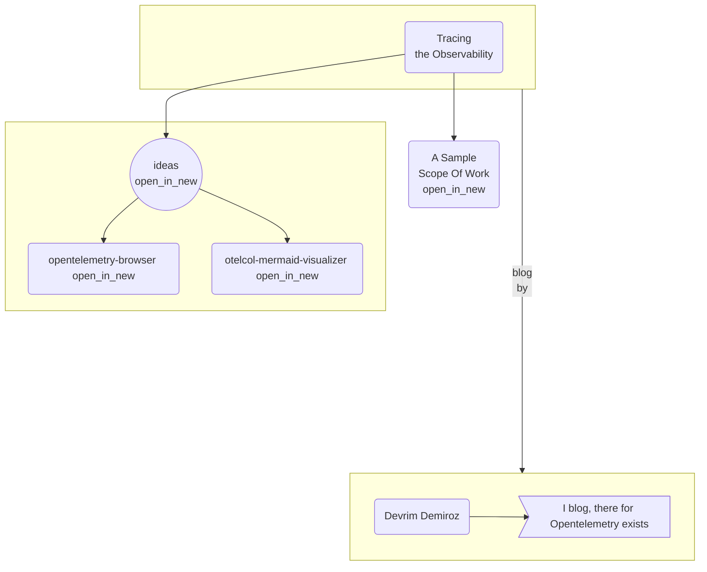

<link href="https://fonts.googleapis.com/icon?family=Material+Icons"
        rel="stylesheet">

```mermaid
flowchart TD

    direction LR
    
    subgraph blog[" "]
     direction LR
        TtO(Tracing <br/> the Observability)
    end
        
    

    blog ------->|blog <br/> by| by        
    
    subgraph s_ideas [" "]

        ideas(("ideas <br/> <span class='material-icons'>open_in_new</span>")) --> 
        opentelemetry-browser("opentelemetry-browser <span class='material-icons'>open_in_new</span>") & otelcol-mermaid-visualizer(otelcol-mermaid-visualizer <span class='material-icons'>open_in_new</span> )
    end
         
     subgraph by[" "]
            DD(Devrim Demiroz)
            DD-->Descartes>I blog, there for Opentelemetry exists]
     end
         
   TtO -->ideas & sow(A Sample <br/> Scope Of Work <br/><span class='material-icons'>open_in_new</span>)
   click sow "/#/ScopeOfWork";     
   click ideas "/#/Ideas";     
   click opentelemetry-browser "https://github.com/devrimdemiroz/opentelemetry-browser" "Open this in a new tab";     
   click otelcol-mermaid-visualizer "/#/ideas/otelcol-mermaid-visualizer";     
    
        

  
```
