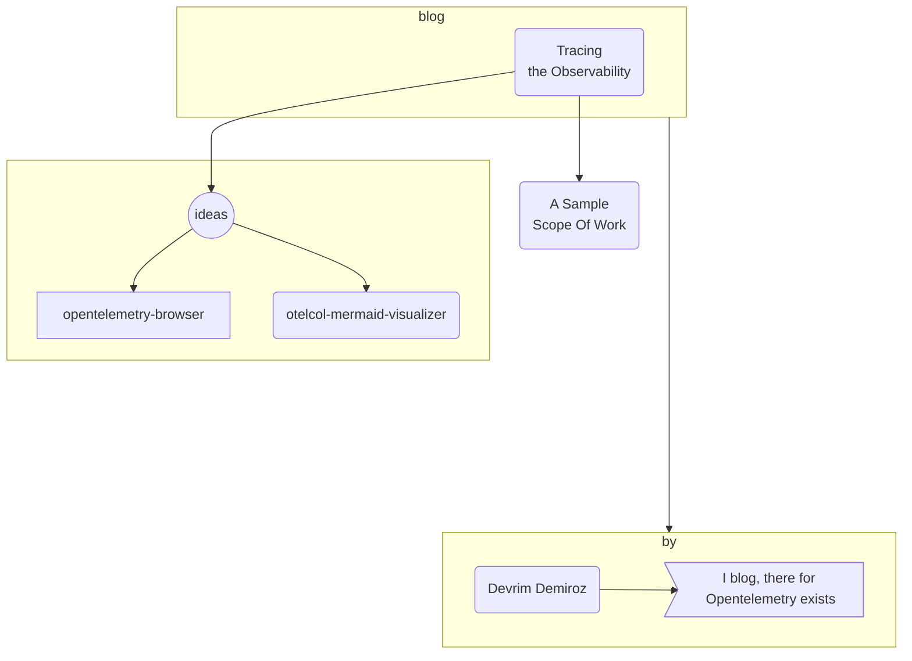

```mermaid
flowchart TD
          
        direction LR
        
        subgraph blog
         direction LR
            TtO(Tracing <br/> the Observability)
        end
        
    

      
   
   
     subgraph by
            DD(Devrim Demiroz)
            DD-->Descartes>I blog, there for Opentelemetry exists]
     end

    blog -------> by        
    
    subgraph s_ideas [" "]

        ideas((ideas)) --> opentelemetry-browser & otelcol-mermaid-visualizer(otelcol-mermaid-visualizer)
    end
         
         
    TtO -->ideas & sow(A Sample <br/> Scope Of Work)
   click sow "/#/ScopeOfWork";     
   click ideas "/#/ideas";     
   click opentelemetry-browser "https://github.com/devrimdemiroz/opentelemetry-browser" "Open this in a new tab";     
   click otelcol-mermaid-visualizer "/#/ideas/otelcol-mermaid-visualizer";     
    
        

  
```
