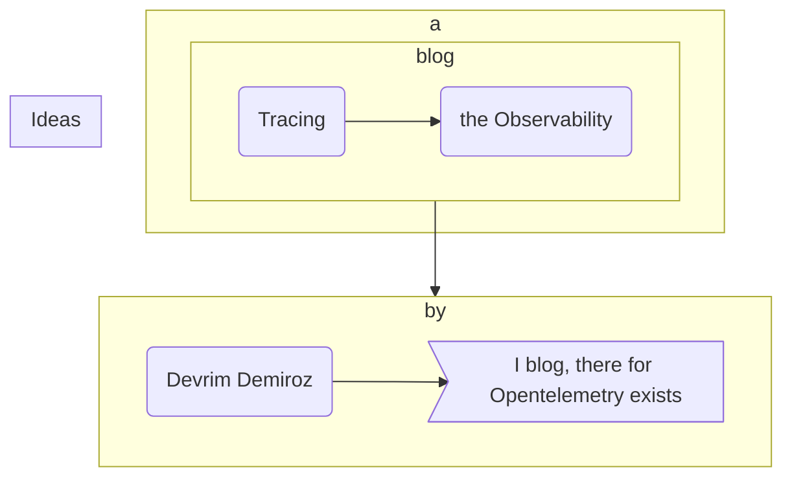

```mermaid
flowchart TD
   
    subgraph a
        direction LR
        
        subgraph blog
         direction LR
            Tracing(Tracing)
            Tracing --> the(the Observability)
        end
        
     
    end
    
     subgraph Ideas
        direction LR
        
     
    end
click Ideas "./#Ideas"
   
   
     subgraph by
            DD(Devrim Demiroz)
            DD-->Descartes>I blog, there for Opentelemetry exists]
     end
    
    blog --> by        
    
        

  
```
