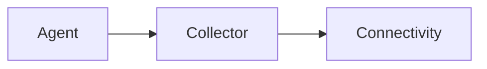

# Abstract

Intended for those who want to know what are deliverables. 
As a former APM consultant, following scope of work is something I derived over the years.
Recently I am adapting the items to Distributed Tracing on K8s. The tasks and their order can be considered vendor neutral.
Yet the main approach basis opentelemetry agents,sdk's, collectors for implementation. 

By passing the analysis cheat sheet for now, the tasks are the things one would be needing when gets hands dirty with realization.

### A Sample Scope of Work for Distributed Tracing Implementation

#### 1- Agent deployment/installation or mining point configurations
- Maximum instrumentation to see what is available as a starting point
- Prepare installations as code for further use
- Kubernetes best practices:
  - Use ConfigMaps to Configure the App Server Agent
  - Use Secrets for the Controller Access Key
  - Set Application-Specific Configuration in the Deployment Spec (Auto inst. embedded into docker image)

#### 2- Collector deployment/installation
- Prepare installations as code for further use

#### 3 - Connectivities

- Towards base tooling
  - X-ray , Jaeger , lightstep, Tempo, Dynatrace
- Inside cluster
  - [!OpenTelemetry Collector Deployment Patterns - Juraci Paixão Kröhling, Red Hat](https://www.youtube.com/watch?v=WhRrwSHDBFs)

#### 4- Instrumentation configurations, observations, and optimizations
- Try Basic reusable test scenarios for application
- If possible, have it re-runnable which can raise trace id as well
- Consider using legacy testing if there are any in further stages
- Shaping instrumentation to a safe level
  - Performance-wise
  - Cardinality
  - Headers, query parameters, req/response bodies
  - SQL etc. contents
  - span events logs
  - jvm/clr level of detail
  - sampling strategies
    - probabilistic/exemplars
    - header flag managed ( head )
    - decide on the collector ( tail )
  - Collector configurations
    - Deployment pattern selection and configuring necessary chaining
    - Extract/add necessary custom attributes
    - filter / anonymize certain attributes  / secure
    - tags
      - team, node name, test id, etc.
    - compliance
      - gdpr , user-related data
    - filter url's
    - filter more, save more
      - € , $ , etc.
    - Extract span metrics

#### 5- Topology configurations
- Real-time service architecture diagram
  - A.K.A. service map
- Plan & Implement Propagation (b3/w3c/etc.)
- Cross component/vm transaction visibilities, lowering gaps

#### 6- Identifying Pool/Bottleneck (possibly SLI ) points, categorisation/aggregation configurations

#### 7- Outbound call visibility
- db,ldap,3rd party service calls, messaging q's

#### 8- Trend/key method measurements ( Optional )

#### 9- Custom Dashboard needs
- Specific Designs as needed
- IAM

#### 10- Umbrella ITSM integrations
- Configure northbound requirements (SLI/SLO/Alarm...)
- Acceptance/Governance

#### 11 - Other
- Security/IAM&OPA
- Identity-based resource level
- Environment(dev/prod/etc.) gdpr and other
- Data retention strategies
- downsampling
- capacity planning needs
- Metric/Trace integration ( Examplars )
- Log trace integration

#### 12 - Revisions with app owner / customer

#### 13 - Rollout and customizations
- per environment local/dev/test/uat/prod
- Helm charts and similar methodologies
- Configurations as code

#### 14 - Documentation
- Implementation Notes covering items above
- Provide developers how they can use tracing in their local during development

#### 15 - Training and handover

#### 16 - Plan future 
- Enhancements, Changes
  - %12 of total effort first 6 months
  - %6 of total effort 6 to 18 months