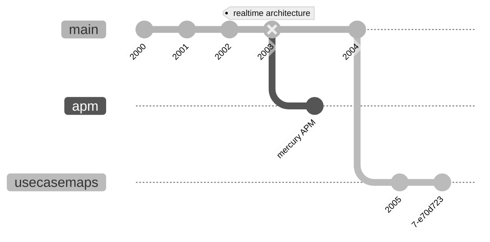

```mermaid
%%{init:
{ 'logLevel': 'debug',
  'theme': 'neutral'
}
}%%
gitGraph
        checkout main
        commit id:"2000"
        commit id:"2001"
        commit id:"2002"
        commit id:"2003" tag:"realtime architecture" type:REVERSE
        branch apm
        commit id:"mercury APM"
        checkout main
        commit id:"2004"
        branch usecasemaps
        commit id:"2005"
        commit
        
        
```
