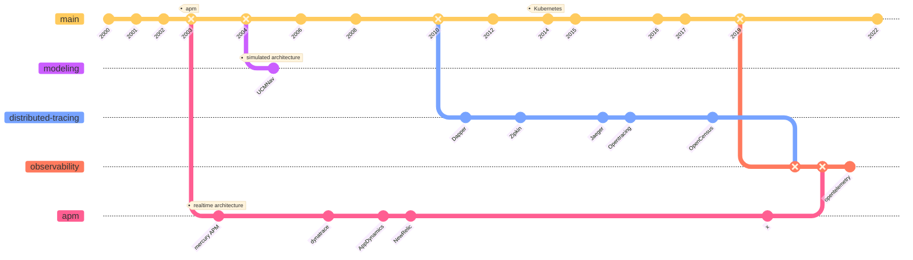

```mermaid
%%{init:
{ 'logLevel': 'debug',
  'theme': 'base'
}
}%%
gitGraph
        checkout main
        commit id:"2000"
        commit id:"2001"
        commit id:"2002"
        commit id:"2003" type:REVERSE tag:"apm"
        branch apm order: 3
        checkout apm
        commit id:"mercury APM" tag:"realtime architecture"
      
        checkout main
        commit id:"2004" type:REVERSE

        branch modeling order: 0
        commit id:"UCMNav" tag:"simulated architecture"

        checkout main
        commit id:"2006"
        checkout apm
        commit id:"dynatrace"

        checkout main
        commit id:"2008"
        checkout apm
        commit id:"AppDynamics"
        commit id:"NewRelic"


        checkout main
        commit id:"2010" type:REVERSE
        branch distributed-tracing order: 2
        commit id:"Dapper"

        checkout main
        commit id:"2012"
        checkout distributed-tracing
        commit id:"Zipkin"


        checkout main
        commit id:"2014" tag:"Kubernetes"
        commit id:"2015"

        checkout distributed-tracing
        commit id:"Jaeger"
        commit id:"Opentracing"

        checkout main
        commit id:"2016"
        commit id:"2017"
        
        checkout distributed-tracing
        commit id:"OpenCensus"
 
        checkout main
        commit id:"2019" type:REVERSE
        checkout apm
        commit id:"x"

        
        checkout main
        branch observability order: 2
        
        
        merge distributed-tracing type:REVERSE
        merge apm type:REVERSE
        commit id:"opentelemetry"
        checkout main
        
        
        commit id:"2022"
```

