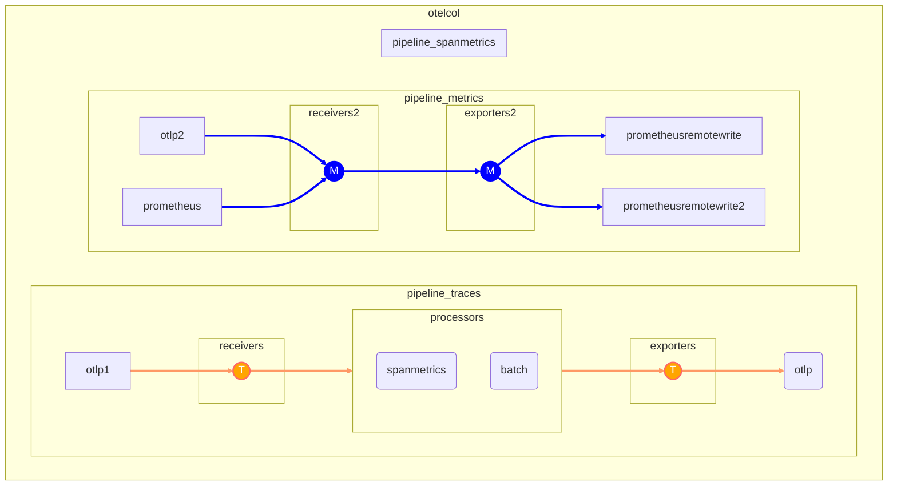

# Opentelemetry Collector Visualization

### Plot
Discussed in  Grafana Agent community call https://www.youtube.com/watch?v=ftopI1chyG0&t=1080s "Focus on data flow..." section, I tried how i would like to extract a visual from otel-config.yaml. Although the aim in discussion is more extensive but more grafana agent targeted, I intentionally tried my perception of visual over otelcol config. Mermaid used likewise in call for Graph as Code purposes here within.

### In action
Spiked an auto generated sample to play with here 

<link rel="stylesheet" href="https://use.fontawesome.com/releases/v5.6.1/css/all.css" integrity="sha384-gfdkjb5BdAXd+lj+gudLWI+BXq4IuLW5IT+brZEZsLFm++aCMlF1V92rMkPaX4PP" crossorigin="anonymous">
<a href="(https://github.com/devrimdemiroz/opentelemetry-browser/blob/main/docs/GeneratedDiagram.md" ><i class="fab fa-github"></i> GeneratedDiagram.md</a>

<i class="fa fa-file-code-o" aria-hidden="true"></i>


### Sample otelcol-config.yaml
```yaml

    service:
      extensions: [pprof, zpages, health_check]
      pipelines:
        traces:
          receivers: [otlp]
          processors: [spanmetrics,batch]
          exporters: [otlp]

        metrics/spanmetrics:
          receivers: [otlp/spanmetrics]
          exporters: [prometheus]

        metrics:
          receivers: [otlp,prometheus]
          exporters: [prometheusremotewrite,prometheusremotewrite/1]
```
---

### Mermaid output sample


### Mermaid output sample as plain Code
```el

flowchart TD

classDef tclass fill:orange,stroke:#f66,stroke-width:2px,color:#fff
classDef mclass fill:blue,stroke:blue,stroke-width:2px,color:#fff

te(otlp)
subgraph otelcol
direction LR
subgraph pipeline_traces
direction LR
subgraph receivers

                T1((T)):::tclass
                
        end
        subgraph processors
                tp1(spanmetrics)
                tp2(batch)
        end
        subgraph exporters
                T2((T)):::tclass
                
                
        end
            otlp1-->T1-->processors-->T2-->te
            linkStyle 0,1,2,3 stroke:#f96,stroke-width:3px,color:orange;
            
    end
         
    subgraph pipeline_metrics
        direction LR
        subgraph receivers2
                
                M1((M)):::mclass
                
        end
    
        subgraph exporters2
                M2((M)):::mclass
                
                
        end
            otlp2 & prometheus -->M1-->M2-->prometheusremotewrite & prometheusremotewrite2
            linkStyle 4,5,6,7,8 stroke:blue,stroke-width:3px,color:blue;
            
    end

subgraph pipeline_spanmetrics
end

end


```
