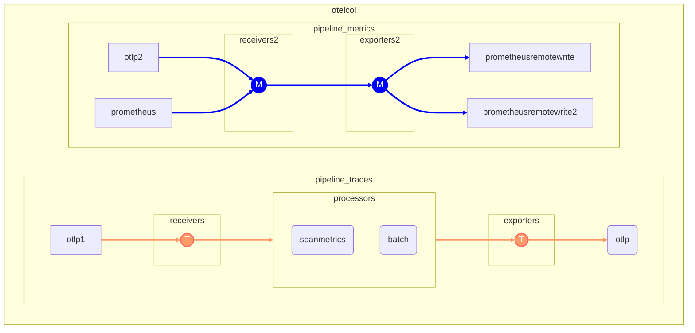

 Discussed in  Grafana Agent community call https://www.youtube.com/watch?v=ftopI1chyG0&t=1080s "Focus on data flow..." section, I tried how i would like to extract a visual from otel-config.yaml.
```yaml

    service:
      extensions: [pprof, zpages, health_check]
      pipelines:
        traces:
          receivers: [otlp]
          processors: [spanmetrics,batch]
          exporters: [otlp]

        metrics/spanmetrics:
          receivers: [otlp/spanmetrics]
          exporters: [prometheus]

        metrics:
          receivers: [otlp,prometheus]
          exporters: [prometheusremotewrite,prometheusremotewrite/1]
```
---


